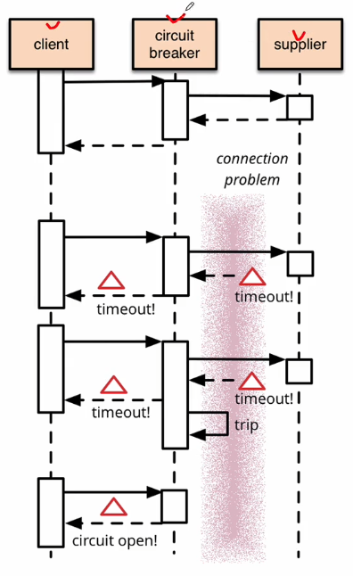

# Section 4

장애 처리와 Microservice 분산 추척

여러개의 마이크로 서비스로 나누어서 개발되다 보니 각각의 서비스에 문제가 생겼을 때 어떻게 처리를 해야하는지, 어떤 서비스가 문제가 발생 했는지, 해당하는 마이크로서비스의 시작점은 어디고 그 다음에 끝났을 때 반환값을 누구한테 전달하는지 등 전체적인 흐름을 추척하는 것은 중요한 부분이다.

회복성 패턴이라 불리는 `CircuitBreaker`, `Resilience4j`, 분산 추척에 대하여 알아보고

분산추적을 할 때 `TraceID` 와 `SpanID`를 알이보고, `Zipkin serever`를 이용하여 마이크로 서비스에 발생되었던 로깅 정보, 트래킹 정보를 저장할 수 있는 기능을 확인

 <details>
  <summary>part 1 / CircuitBreaker, Resilience4j 사용하기 </summary>
  <div markdown="1">

`CircuitBreaker`은 간단하게 장애가 발생하는 서비스에 반복적인 호출이 되지 못하게 차단을 한다. 그리고 특정 서비스가 정상적인 동작을 하지 않을 경우 다른 기능으로 대체 수행을 하도록 만들어 장애에 대해서 회피가 가능하다.


```java
List<ResponseOrder> ordersList = orderServiceClient.getOrders(userId);
/* 기존 코드에서 아래와 같이 변경 */
CircuitBreaker circuitBreaker = circuitBreakerFactory.create("circuitBreaker");
List<ResponseOrder> ordersList = circuitBreaker.run(() -> orderServiceClient.getOrders(userId), throwable -> new ArrayList<>());
```

`CircuitBreaker`패턴을 사용하여 `orderServiceClient.getOrders(userId)`을 호출 할 때 장애 발생 시 대체 동작을로 비어있는 리스트를 반환하도록 설정을 했다.

  </div>
</details>

_토글_

```html
<details>
  <summary>part</summary>
  <div markdown="1"></div>
</details>
```
